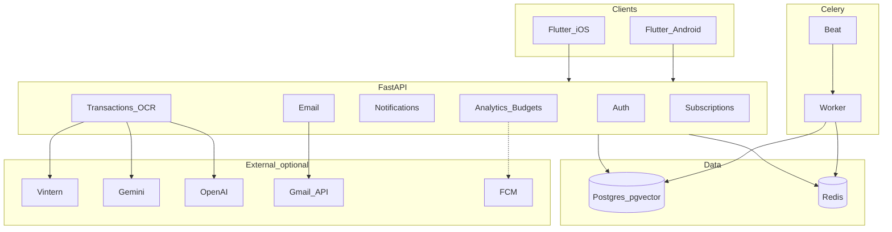

# Tuchi — Tài liệu hệ thống hiện tại

Tài liệu mô tả **trạng thái thực tế** của codebase (không phải roadmap).  
Cập nhật theo repo tại thời điểm viết; đặc tả gốc xem [`pipeline_app_quan_ly_chi_tieu.md`](pipeline_app_quan_ly_chi_tieu.md), hướng dẫn vận hành xem [`README.md`](README.md).

---

## 1. Tổng quan

**Tuchi** là ứng dụng quản lý chi tiêu cá nhân, tập trung thị trường Việt Nam:

- Nhập giao dịch bằng **chụp hóa đơn (OCR)**, **screenshot thanh toán**, **bắt thông báo Android**, **Gmail**, hoặc **nhập tay / dán SMS**.
- **Phân loại chi tiêu** theo category (cascade: rule → vector cá nhân → merchant graph → LLM).
- **Ngân sách**, **cảnh báo**, **phân tích**, **dự báo cashflow**, **phát hiện subscription**.

### Kiến trúc tổng thể

```
┌─────────────────────────────────────────────────────────────┐
│  Flutter (Riverpod + go_router)                             │
│  Android / iOS  —  cùng codebase mobile/lib                 │
└───────────────────────────┬─────────────────────────────────┘
                            │ HTTPS/HTTP  JWT Bearer
                            ▼
┌─────────────────────────────────────────────────────────────┐
│  FastAPI  (/api/v1)                                         │
│  OCR · Classify · Analytics · Email · Notifications · Auth  │
└───────┬─────────────────────┬───────────────────┬───────────┘
        │                     │                   │
        ▼                     ▼                   ▼
 PostgreSQL 16            Redis 7            Celery worker
 + pgvector               (broker)           + Celery beat
```

| Lớp | Công nghệ đang dùng |
|---|---|
| Mobile | Flutter, Riverpod, go_router, `http`, fl_chart, `image_picker`, `notification_listener_service` |
| Backend | FastAPI, SQLAlchemy async, Pydantic Settings, JWT + bcrypt |
| DB | PostgreSQL 16 + **pgvector** (HNSW) |
| Queue | Celery 5 + Redis 7 |
| OCR Smart Track | VietOCR Fast Track; fallback Vintern → Gemini → OpenAI |
| OCR Fast Track | **VietOCR** ([pbcquoc/vietocr](https://github.com/pbcquoc/vietocr)) + OpenCV line detect + regex parse |
| Classify LLM | **Qwen3 8B (Ollama)** → OpenAI → Gemini |
| Classify | Hash embedding (mặc định) hoặc sentence-transformers (tùy chọn) |
| Forecast | statsmodels Holt-Winters |
| Push | `firebase-admin` (tắt mặc định); mobile dùng **poll + local notification** |

---

## 2. Cấu trúc thư mục

```
tuchi/
├── README.md                          # Hướng dẫn chạy, API tóm tắt
├── pipeline_app_quan_ly_chi_tieu.md   # Đặc tả kiến trúc gốc (có phần aspirational)
├── HE_THONG_HIEN_TAI.md               # Tài liệu này
├── docker-compose.yml
├── .env.example
├── backend/
│   ├── Dockerfile
│   ├── requirements.txt
│   ├── requirements-ml.txt            # sentence-transformers (tùy chọn)
│   ├── modal/vintern_serve.py         # Serve Vintern trên Modal (tùy chọn)
│   ├── scripts/
│   │   ├── init_db.sql                # CREATE EXTENSION vector
│   │   └── migrations/                # SQL thủ công (chưa có Alembic project)
│   ├── tests/
│   └── app/
│       ├── main.py                    # FastAPI app + lifespan (schema, HNSW)
│       ├── config.py
│       ├── deps.py                    # JWT dependency
│       ├── worker.py                  # Celery tasks + beat schedule
│       ├── db/session.py
│       ├── models/
│       ├── schemas/
│       ├── routers/                   # HTTP endpoints
│       └── services/                  # Business logic
└── mobile/
    ├── pubspec.yaml
    ├── lib/                           # Toàn bộ UI + logic app
    ├── android/                       # Flutter Android host + manifest
    ├── ios/                           # Flutter iOS host
    └── scripts/                       # Signing iOS / Android, build IPA
```

**Lưu ý quan trọng:** `mobile/ios` và `mobile/android` chỉ là **Flutter host**. Mọi màn hình và tính năng nằm trong `mobile/lib` — một codebase cho cả hai nền tảng.

---

## 3. Luồng nghiệp vụ chính

### 3.1. Chụp hóa đơn (Receipt OCR)

```
Mobile                    Backend
  │                         │
  │  Chọn/chụp ảnh          │
  │  Edge Gate IQA          │  (Laplacian variance — package:image)
  │  (threshold ~100)       │
  │                         │
  │  POST /transactions/process-receipt  (multipart)
  │ ───────────────────────►│
  │                         │  Fast Track (regex trên text hint)
  │                         │    └─ không có local OCR → thường skip
  │                         │  Smart Track: Qwen3-VL (Ollama) → Vintern → Gemini → OpenAI
  │                         │  Normalize items + sửa merchant (fuzzy)
  │                         │  Classify cascade
  │                         │  (tuỳ chọn) lưu Transaction source=ocr
  │◄───────────────────────│  OCR + classification + transaction_id
  │                         │
  │  User xác nhận category │
  │  POST .../confirm       │
  │────────────────────────►│  Cập nhật vector cá nhân + merchant graph
```

### 3.2. Screenshot thanh toán (Payment OCR)

```
Mobile → IQA (threshold ~60) → POST /transactions/process-payment-screenshot
       → Backend: extract (vision + regex) → classify → lưu giao dịch
```

Khác hóa đơn: tối ưu cho UI ví/ngân hàng (merchant, số tiền, mã giao dịch), không kỳ vọng danh sách món ăn/hàng hóa chi tiết.

### 3.3. Bắt thông báo Android

```
App ngân hàng/ví
      │  System notification
      ▼
NotificationListenerService (plugin)
      │
      ▼
On-device parser (regex template từ server, cache SharedPreferences)
      │  Chỉ gửi: package_name, amount, merchant
      │  KHÔNG upload nội dung thông báo gốc
      ▼
POST /notifications/ingest
      │  Dedup ~5 phút theo amount/merchant
      ▼
Classify → Transaction (source=notification) → kiểm tra ngân sách
```

**App được hỗ trợ (khớp template backend):** Vietcombank, MB Bank, MoMo, VietinBank, TPBank, Techcombank.

### 3.4. Gmail (iOS / thay thế notification)

```
User → GET /email/oauth/url → đăng nhập Google → dán code → POST /email/connect
     → POST /email/sync (hoặc Celery mỗi 6h)
     → Parse email ngân hàng/ví → Transaction (source=email)
```

### 3.5. Quick Add (dán SMS / text)

User dán nội dung → parser on-device → tạo giao dịch thủ công / ingest tương đương — hữu ích trên iOS khi không có Notification Listener.

### 3.6. Ngân sách & cảnh báo

1. User tạo budget theo category (`POST /budgets`).
2. Mỗi khi có giao dịch mới (OCR / notification / email / manual) hoặc job Celery ban đêm → tính % đã dùng.
3. Ngưỡng **80% / 100% / 120%** → ghi `Alert` (+ dedup `BudgetAlertSent`).
4. **Mobile:** `AlertPoller` poll `/alerts?unread_only=true` mỗi **5 phút** → hiện local notification.  
   **FCM:** có API đăng ký thiết bị + `firebase-admin`, nhưng **mobile chưa gọi `registerDevice`**, `FCM_ENABLED=false` mặc định.

### 3.7. Cashflow

1. User lưu `starting_balance` (+ tùy chọn `monthly_income`) qua `/cashflow/profile`.
2. `GET /analytics/cashflow-insights` → burn rate, số dư dự kiến cuối tháng, ngày cạn tiền (nếu có), gợi ý cắt giảm theo category.
3. Hiển thị trên tab **Phân tích**.

### 3.8. Subscription

- Job Celery hàng ngày + nút Detect trên mobile quét giao dịch lặp lại (merchant + amount + chu kỳ).
- User có thể dismiss; analytics có summary subscription.

---

## 4. Backend chi tiết

### 4.1. Khởi động & schema

- `docker compose up` → Postgres (init `vector`), Redis, API, worker, beat.
- API lifespan: `Base.metadata.create_all` + tạo index HNSW cho embedding.
- **Chưa có Alembic project** — chỉ SQL thủ công trong `backend/scripts/migrations/`.

### 4.2. Auth

| Endpoint | Mô tả |
|---|---|
| `POST /api/v1/auth/register` | Đăng ký email/password |
| `POST /api/v1/auth/login` | Trả `access_token` (JWT HS256) |
| `GET /api/v1/auth/me` | Thông tin user hiện tại |

- Password: bcrypt.
- Các route nghiệp vụ: `Authorization: Bearer <token>`.
- Secret mặc định trong compose: `dev-secret-change-in-production` — **đổi khi deploy thật**.

### 4.3. Danh sách API (đang có)

| Nhóm | Method + Path |
|---|---|
| Health | `GET /health` |
| Auth | `POST /auth/register`, `/auth/login`, `GET /auth/me` |
| Transactions | `GET/POST /transactions`, `PATCH /transactions/{id}`, `POST .../confirm` |
| OCR | `POST /transactions/process-receipt`, `POST /transactions/process-payment-screenshot` |
| Notifications | `POST /notifications/ingest`, `GET /notification-templates` |
| Categories | `GET /categories` |
| Budgets | `GET/POST /budgets` |
| Alerts | `GET /alerts`, `POST /alerts/{id}/read` |
| Analytics | `GET /analytics/summary`, `/forecasts`, `/pipeline-health`, `/subscriptions-summary`, `/cashflow-insights` |
| Cashflow | `GET/POST /cashflow/profile` |
| Devices | `POST /devices/register`, `DELETE /devices/unregister` |
| Email | `GET /email/oauth/url`, `POST /email/connect`, `GET /email/oauth/callback`, `GET /email/status`, `POST /email/sync`, `DELETE /email/disconnect` |
| Subscriptions | `GET /subscriptions`, `POST /subscriptions/detect`, `POST /subscriptions/{id}/dismiss` |

Prefix chung: `/api/v1` (trừ `/health`).

### 4.4. Services (thư mục `backend/app/services/`)

| Thư mục | Vai trò thực tế |
|---|---|
| `ocr/` | Pipeline Fast/Smart Track, Vintern client, sửa merchant tham chiếu |
| `payment_screenshot/` | Extract riêng cho screenshot ví/NH |
| `classify/` | Cascade phân loại, embedding, taxonomy LLM, merchant graph, community graph |
| `analytics/` | Budget, forecast Holt-Winters, cashflow, subscriptions, anomaly, recommendations |
| `email/` | Gmail OAuth + sync |
| `metrics/` | Đếm OCR/classify daily, pipeline-health, đề xuất auto-tune |
| `push/fcm.py` | Gửi FCM nếu bật |
| `notification.py` | Ingest + dedup |
| `auth.py`, `transactions.py`, `normalize/` | Auth helpers, CRUD giao dịch, chuẩn hóa số/chuỗi |

### 4.5. Cascade OCR (Receipt)

1. **Fast Track (mặc định):** [VietOCR](https://github.com/pbcquoc/vietocr) (`vgg_seq2seq`) + OpenCV line detection → regex parse merchant/amount/date/items.
2. **Smart Track** (khi Fast Track yếu / ảnh xấu):  
   **Vintern** (nếu cấu hình) → **Gemini** → **OpenAI** → heuristic trên raw text.  
   **Không dùng Qwen-VL cho OCR** (Ollama `qwen3` chỉ dùng cho phân loại LLM).
3. Ghi metrics phục vụ pipeline-health.

```bash
pip install -r backend/requirements.txt   # gồm vietocr + torchvision
# Lần đầu chạy sẽ tải weight vgg_seq2seq.pth (~tự động)
```

### 4.6. Cascade phân loại (PVC-Class)

Thứ tự điển hình:

1. Rule / taxonomy cơ bản trên item (nếu có `items[]`).
2. **Personal Vector Store** — kNN trên `personal_merchant_embeddings` (pgvector).
3. **Global Merchant Graph** — merchant đã biết cộng đồng / hệ thống.
4. **LLM taxonomy** — **Qwen3 8B (Ollama)** trước; OpenAI/Gemini fallback khi cold-start / confidence thấp.
5. User **confirm category** → cập nhật embedding cá nhân + tín hiệu community.

Embedding mặc định: **hash** (không cần GPU). Bật `USE_SENTENCE_EMBEDDINGS=true` + cài `requirements-ml.txt` để dùng sentence-transformers đa ngữ.

### 4.7. Mô hình dữ liệu (SQLAlchemy)

| Model / bảng | Ý nghĩa |
|---|---|
| `User` | Tài khoản |
| `Category` | Danh mục chi tiêu |
| `Merchant` | Merchant chuẩn hóa |
| `Transaction` | Giao dịch (`source`: `ocr` \| `notification` \| `manual` \| `email`) |
| `TransactionEmbedding` | Vector 768 (pgvector) |
| `Budget` | Ngân sách theo category / kỳ |
| `Alert` | Cảnh báo (budget, anomaly,…) |
| `BudgetAlertSent` | Dedup cảnh báo budget |
| `NotificationTemplate` | Regex theo `package_name` cho Android |
| `MerchantReference` | Tham chiếu sửa tên merchant OCR |
| `PersonalMerchantEmbedding` | Vector cá nhân sau confirm |
| `UserDevice` | FCM token (khi dùng push) |
| `CategoryForecast` | Dự báo theo category |
| `EmailConnection` | Refresh token Gmail (nhạy cảm) |
| `DetectedSubscription` | Subscription phát hiện được |
| `CommunityMerchantSignal` | Tín hiệu cộng đồng |
| `UserCashflowProfile` | Số dư đầu tháng / thu nhập |
| `PipelineMetricDaily` | Metrics OCR/classify theo ngày |

### 4.8. Celery Beat (múi giờ Asia/Ho_Chi_Minh)

| Task | Lịch | Việc |
|---|---|---|
| `run_nightly_analytics` | 02:00 hàng ngày | Budget alerts + anomaly |
| `run_nightly_forecasts` | 02:30 hàng ngày | Holt-Winters theo category |
| `rebuild_merchant_graph` | CN 03:00 | Rebuild graph + community |
| `sync_all_emails` | Mỗi 6 giờ | Sync Gmail đã kết nối |
| `detect_all_subscriptions` | 04:00 hàng ngày | Quét subscription |
| `gpu_auto_tune` | T2 05:00 | Đề xuất chỉnh ngưỡng OCR (advisory) |

**Hạn chế compose hiện tại:** service `worker` / `beat` chỉ nhận `DATABASE_URL` + `REDIS_URL`. Thiếu `GMAIL_CLIENT_*` / API keys trên worker có thể làm một số job (email refresh OAuth) lỗi nếu cần secret từ settings — nên đồng bộ env với `api` khi chạy production.

---

## 5. Mobile chi tiết

### 5.1. Stack UI

| Thành phần | Thư viện |
|---|---|
| State | `flutter_riverpod` |
| Routing | `go_router` (auth redirect + shell 4 tab) |
| HTTP | `http` + `ApiClient` + Bearer token |
| Secure storage | `flutter_secure_storage` (`access_token`) |
| Biểu đồ | `fl_chart` |
| Ảnh | `image_picker` + `image` (IQA) |
| Android capture | `notification_listener_service` |
| Local notif | `flutter_local_notifications` |

**Theme:** Material 3 light — primary `#F2C300`, secondary `#2B6490`, nền `#F6F6F6`. UI tiếng Việt.

### 5.2. Điều hướng

```
/login
   │ (có token)
   ▼
HomeScreen (AppBar + 4 tab)
├── /              TransactionsScreen
├── /capture       CaptureScreen → /capture/receipt | /capture/payment
├── /budget        BudgetScreen
└── /analytics     AnalyticsScreen

Ngoài shell:
  /quick-add
  /settings/notifications
  /settings/email
  /subscriptions
  /transactions/:id
```

AppBar: Quick Add · Theo dõi thông báo · Menu (Subscriptions, Email, Logout).

### 5.3. Màn hình & tính năng

| Màn hình | Chức năng |
|---|---|
| Login / Register | Email/password, cấu hình API URL, health check |
| Giao dịch | Danh sách, pull-to-refresh, chip xác nhận category |
| Chi tiết giao dịch | Merchant, amount, OCR items, meta phân loại |
| Nhập ảnh (hub) | Chọn Receipt OCR vs Payment OCR |
| Receipt / Payment | Camera/gallery → IQA → upload → kết quả |
| Ngân sách | Progress theo % (màu đổi ở 80%/100%), thêm budget |
| Phân tích | Pie/line, forecast, cashflow, alerts, pipeline health, subs |
| Quick add | Dán text → parse amount → tạo giao dịch |
| Theo dõi giao dịch | Android: Notification Access + bật/tắt capture |
| Email | Gmail OAuth URL → paste code → sync / disconnect |
| Subscriptions | Danh sách, tổng tháng, dismiss, detect lại |

### 5.4. Android-specific

| Hạng mục | Chi tiết |
|---|---|
| Listener | Service trong `AndroidManifest.xml` |
| Quyền | `INTERNET`, `CAMERA`, `POST_NOTIFICATIONS`, `FOREGROUND_SERVICE*`, `WAKE_LOCK`, `RECEIVE_BOOT_COMPLETED` |
| Cleartext | `usesCleartextTraffic=true` (dev HTTP) |
| Capture | Persist `notification_capture_enabled`; ongoing local notif khi đang theo dõi; hủy khi stop/logout |
| Runtime | Xin `POST_NOTIFICATIONS` (Android 13+) qua `flutter_local_notifications` |
| Signing | `key.properties` + `scripts/setup_android_signing.sh`; release fallback debug nếu chưa có keystore |
| API mặc định | Emulator: `http://10.0.2.2:8000/api/v1` |

### 5.5. iOS-specific

| Hạng mục | Chi tiết |
|---|---|
| Notification Listener | **Không hỗ trợ** (giới hạn OS) |
| Thay thế | Gmail sync + Quick Add + OCR |
| ATS | `NSAllowsArbitraryLoads=true` (dev) |
| Thiết bị thật | Bắt buộc nhập IP LAN (không dùng `localhost`) — `AppConfig.needsManualServerUrl` |
| Signing / IPA | `scripts/setup_ios_signing.sh`, `build_ipa_ac.sh` (xem README) |

### 5.6. Cấu hình API URL

Ưu tiên:

1. SharedPreferences (`api_base_url`) — chỉnh trên màn Login  
2. `--dart-define=API_BASE_URL=...`  
3. Mặc định theo platform (emulator/sim)

Chuẩn hóa path luôn kết thúc bằng `/api/v1`.

---

## 6. Hạ tầng & vận hành

### 6.1. Docker Compose

| Service | Image / lệnh | Port |
|---|---|---|
| `postgres` | `pgvector/pgvector:pg16` | 5432 |
| `redis` | `redis:7-alpine` | 6379 |
| `api` | uvicorn `--reload` | 8000 |
| `worker` | celery worker | — |
| `beat` | celery beat | — |

Volumes: `postgres_data`, `receipt_uploads`.

```bash
cp .env.example .env   # điền API keys nếu cần OCR vision / Gmail
docker compose up --build
```

### 6.2. Biến môi trường chính

| Biến | Mặc định / ý nghĩa |
|---|---|
| `DATABASE_URL` | Postgres async (compose tự set) |
| `REDIS_URL` | Redis broker |
| `JWT_SECRET` | Secret ký JWT |
| `OPENAI_API_KEY` / `GEMINI_API_KEY` | Smart Track / LLM fallback (tùy chọn) |
| `VIETOCR_ENABLED` / `VIETOCR_MODEL` | OCR local (`vgg_seq2seq` mặc định) |
| `OLLAMA_ENABLED` / `OLLAMA_BASE_URL` | Local Qwen **classify** (mặc định bật, `:11434`) |
| `OLLAMA_LLM_MODEL` | Mặc định `qwen3:8b` (không dùng VL cho OCR) |
| `VINTERN_API_URL` / `VINTERN_API_KEY` / `VINTERN_MODEL_NAME` | OCR Smart Track phụ (tùy chọn) |
| `FCM_ENABLED` | `false` |
| `FIREBASE_CREDENTIALS_PATH` | JSON service account |
| `USE_SENTENCE_EMBEDDINGS` | `false` |
| `GMAIL_CLIENT_ID` / `SECRET` / `REDIRECT_URI` | OAuth Gmail |
| `SMART_TRACK_TARGET_PCT` | Mục tiêu % smart-track (auto-tune) |
| `COMMUNITY_MIN_DISTINCT_USERS` | Ngưỡng promote community merchant |

### 6.3. Chạy không Docker

```bash
# Backend
cd backend && pip install -r requirements.txt
uvicorn app.main:app --reload --port 8000
celery -A app.worker.celery_app worker --loglevel=info
celery -A app.worker.celery_app beat --loglevel=info

# Mobile
cd mobile && flutter pub get && flutter run
```

---

## 7. Bảo mật & quyền riêng tư

| Chủ đề | Hiện trạng |
|---|---|
| Auth | JWT self-hosted, bcrypt password |
| CORS | `allow_origins=["*"]` (dev-friendly) |
| HTTP cleartext | Cho phép trên Android + iOS (dev LAN) |
| Notification | Chỉ structured fields lên server — **không** gửi raw text thông báo |
| Gmail | Lưu `refresh_token` trong DB — cần bảo vệ DB / mã hóa at-rest khi production |
| Upload ảnh | Lưu volume local `receipt_uploads` — chưa S3/MinIO, chưa mã hóa at-rest |
| Secret mặc định | `JWT_SECRET` compose chỉ dùng cho dev |
| FCM | Chưa wire end-to-end trên mobile |

---

## 8. Phân biệt “đã code” vs “chưa dùng / stub”

README đánh dấu Phase 1–4 ✅ theo nghĩa **tính năng đã có trong code**. Một số hạng mục **chưa hoàn tất end-to-end**:

| Hạng mục | Trạng thái thực |
|---|---|
| Receipt / Payment OCR (vision) | **Qwen3-VL qua Ollama** (ưu tiên); Gemini/OpenAI/Vintern fallback |
| Classify LLM | **Qwen3 qua Ollama** (ưu tiên); cloud fallback |
| Fast Track OCR local (VietOCR) | **Stub** — chưa engine local |
| Edge Gate IQA | **Có** (Laplacian), không dùng TFLite/OpenCV |
| Personal Vector + confirm | **Có** |
| Sentence-transformers | Tùy chọn, **tắt** mặc định |
| Android Notification Capture | **Có** (code + manifest + quyền) |
| Budget alerts | **Có** qua DB + poll local trên mobile |
| FCM push realtime | Backend có; mobile **không đăng ký token**; `FCM_ENABLED=false` |
| Gmail sync | **Có** nếu cấu hình OAuth |
| Holt-Winters / subscriptions / community / pipeline-health | **Có** |
| Drift / SQLite offline | Có trong `pubspec.yaml` — **không dùng trong code** |
| Alembic | Có package — **không có migration project** |
| S3, PhoBERT, Firebase Auth, TFLite IQA | Chỉ trong đặc tả pipeline — **không có trong repo** |
| `flutter_foreground_task` | Đã **gỡ**; dùng ongoing local notification |

---

## 9. Workflow người dùng theo nền tảng

| Nền tảng | Luồng điển hình |
|---|---|
| **Chung** | Đăng ký/đăng nhập → OCR hoặc nhập tay → xác nhận category → Budget / Phân tích |
| **Android** | 🔔 Theo dõi giao dịch → cấp Notification Access → bật capture → giao dịch tự vào |
| **iOS** | ✉️ Gmail sync và/hoặc ➕ Quick Add (dán SMS) + OCR |
| **Phân tích** | Cashflow profile → insights; Subscriptions; Pipeline health |

---

## 10. Sơ đồ thành phần (tóm tắt)



---

## 11. Tài liệu liên quan

| File | Nội dung |
|---|---|
| [`README.md`](README.md) | Chạy stack, API sample, iPad IPA, Celery |
| [`pipeline_app_quan_ly_chi_tieu.md`](pipeline_app_quan_ly_chi_tieu.md) | Đặc tả kiến trúc / roadmap gốc |
| [`.env.example`](.env.example) | Template biến môi trường |
| [`docker-compose.yml`](docker-compose.yml) | Dev orchestration |
| [`mobile/scripts/setup_android_signing.sh`](mobile/scripts/setup_android_signing.sh) | Release keystore Android |
| [`mobile/scripts/setup_ios_signing.sh`](mobile/scripts/setup_ios_signing.sh) | Signing iOS Personal Team |

---

## 12. Kết luận ngắn

Hệ thống hiện tại là **Flutter ↔ FastAPI ↔ PostgreSQL/pgvector + Redis/Celery**, đủ vòng đời chi tiêu cá nhân: nhập đa kênh (OCR, notification Android, email, manual), phân loại cascade, ngân sách/cảnh báo (poll), analytics/cashflow/subscription.

Điểm cần nhớ khi mở rộng hoặc deploy:

1. OCR ưu tiên **VietOCR** local; Smart Track (Gemini/OpenAI/Vintern) chỉ fallback. Ollama `qwen3` dùng cho phân loại.  
2. Cảnh báo realtime cần wire FCM (hoặc chấp nhận poll 5 phút).  
3. Offline Drift và VietOCR local vẫn là nợ kỹ thuật.  
4. Đồng bộ env worker với API; đổi `JWT_SECRET`; tắt cleartext khi production.
